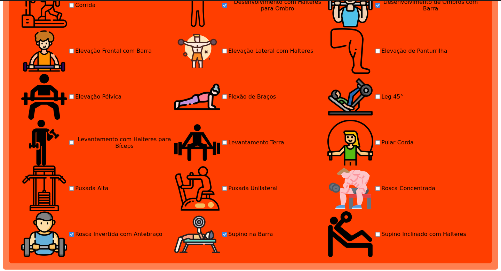

# Guia de Academia 2.0

**Conteúdo da Disciplina**: Final 

## Alunos
|Matrícula | Aluno |
| -- | -- |
| 180149598  |  Victor Hugo SIqueira Costa |
| 180029240  |  Wesley Pedrosa dos Santos |

## Sobre 
* O **Guia de Academia 2.0** é uma versão evoluida do aplciativo do trabalho de *Grafos 1*. Esta versão contém features que envolvem *algoritmos ambiciosos (Greed)* e *dividir e conquistar (DC)* além de correção de bugs.

Visando ajudar a obter um melhor rendimento durante os treinos na academia, o **Guia de Academia** lhe indicará a melhor sequência de exercícios, baseado nos exercícios que você possuí interesse, seguindo o caminho mais eficiente através de um critério prático.

## Screenshots
 
 
 

## Instalação 
**Linguagem**: JavaScript, HTML, CSS 
**Framework**: Svelte 
* 1°: Mover para a pasta do diretório do projeto: *cd Final_GuiaDeAcademia2.0/Guia-de-Academia/*
* 2°: Rodar *npm i* e em seguidda *npm run dev* 
* 3°: No navegador abrir a porta local 3000: *http://localhost:3000/* 

## Uso 
* Escolha o exercícios que tiver interesse
* Clique em *Mostrar Sequência de Treino* para ver o resultado
* Caso deseje testar outra sequência clique em *Voltar para o Menu*